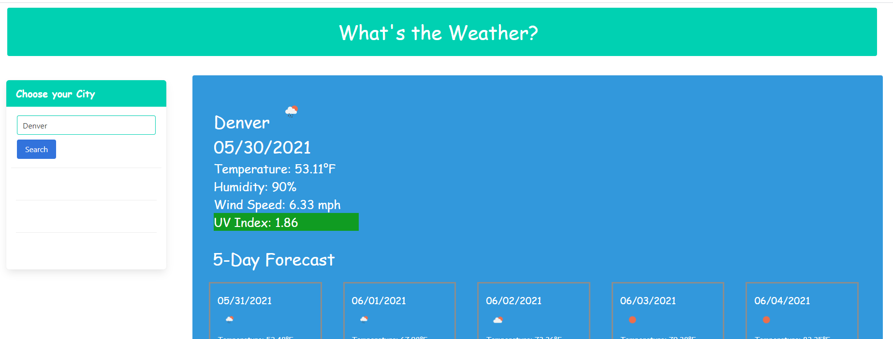

This webpage is to help individuals review current and forecasted weather for an entered city. It will present the user with large information regarding the current weather for the entered city and the smaller information regarding forecasted data. The current weather will include the current UV index. The UV index will be color coded to ensure a clear understanding of the UV index implications. In addition the page will save past searched for quick recall. 

Resources used for this webpage include OpenWeather, YouTube, tutor and coursework.

